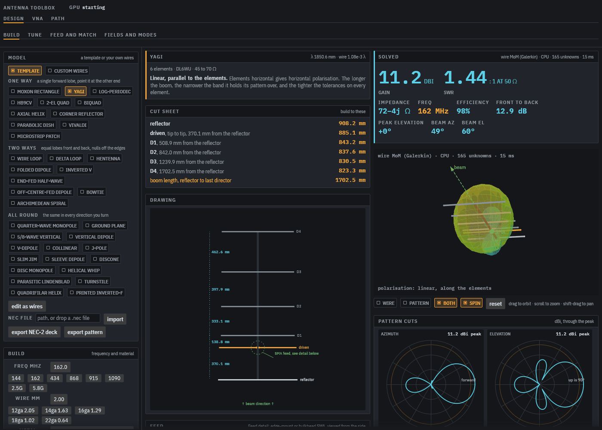

# antenna toolbox

A desktop app for designing antennas, measuring them with a NanoVNA and
planning the radio paths they will be used on. It also runs in the browser at
[wire-antenna-calc.pages.dev](https://wire-antenna-calc.pages.dev).



## Design

Pick one of 36 templates (Yagi, Moxon, log-periodic, quad, J-pole, collinear,
QFH, discone, helix, dish, Vivaldi, microstrip patch, printed inverted-F and
more), set the frequency and wire, and get a cut sheet, a drawing and a feed
detail. Every design is solved, not looked up:

- Wire antennas by the method of moments (Galerkin, NEC-2 style), with wire
  loss, insulation, lumped loads, transmission lines and networks, free space,
  perfect ground or real ground by Sommerfeld integrals.
- Sheet antennas by RWG surface MoM, on the GPU where there is one. Dishes by
  physical optics.
- Printed antennas by FDTD with the board's dielectric, on the GPU (WebGPU in
  the browser) with a CPU fallback.
- NEC-2 decks import and export, so a model can go to and from 4nec2 or nec2c.

Then tune the sizes by hand or with the optimiser, synthesise an L, pi, T, stub
or quarter-wave match from standard part values, check near-field RF exposure
against ICNIRP 2020 and FCC limits, and look at the characteristic modes the
shape supports.

## VNA

Drives a NanoVNA-H or H4 over USB (Web Serial in Chrome and Edge), with SOL
calibration, a combined SWR, return loss, Smith and impedance display, and
cable de-embedding by cable type or from a sweep of the open cable. The
NanoVNA V2 driver is written but untested on hardware.

## Path

Terrain comes from Copernicus GLO-30 at full 30 m resolution.

- **Point to point**: terrain profile with earth curvature and Fresnel zone,
  Longley-Rice (ITM) path loss, or ITU-R P.528 for aircraft, P.2108 clutter,
  and P.452 for how often ducting brings a path in.
- **Broadcast coverage**: a SPLAT!-style map of signal margin out to 500 km,
  with your antenna's pattern and the receivers' pattern applied at each
  point's takeoff and arrival angles.
- **HF sky map**: ITU-R P.533 circuit reliability by hour and band between two
  points, the MUF through the day, and a world map of reliability from the
  transmitter.

Patterns for the path come from the design tab, a NEC-2 output file or a
SPLAT! `.az`/`.el` pair.

## Validation

Each model is checked against the implementation it was ported from or a
published measurement: nec2c, NTIA ITM and P.528, SPLAT!, the ITU P.452 and
P.2108 test sets, ITURHFProp, and Sheen's 1990 patch. The numbers are in
[docs/validation.md](docs/validation.md).

## Install

Installers for Linux (`.deb` and tarball), macOS (`.dmg`, Apple silicon) and
Windows (`.msi` and zip) are on the
[releases page](https://github.com/v0l/antenna-toolbox/releases). The macOS
build is not notarised, so the first launch needs right-click, Open.

## Build

```sh
cargo run --release -p antenna-toolbox
cargo test --release --workspace
```

Linux needs `libudev-dev` and the usual X11 or Wayland headers. The browser
build is described in [web/README.md](web/README.md).

## Acknowledgements

The propagation code is ported from public reference implementations, each
changed from the original into Rust:

- Longley-Rice ITM, ITU-R P.528 and P.2108 from NTIA's
  [ITS propagation models](https://github.com/NTIA), which are US government
  works.
- ITU-R P.452 from [Py452](https://github.com/eeveetza/Py452) by Ivica Stevanović.
- ITU-R P.533 and P.372 from ITU-R Study Group 3's
  [ITURHFProp](https://github.com/ITU-R-Study-Group-3/ITU-R-HF). The
  ionospheric maps are fetched from that repository when needed.

## License

MIT
